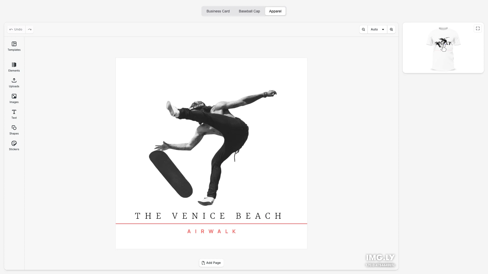

# 3D Product Configurator Starter Kit

Create interactive 3D product previews for your web app — design on a 2D canvas and see changes reflected in real-time on 3D models. Built with [CE.SDK](https://img.ly/creative-sdk) and [Google Model Viewer](https://modelviewer.dev/) by [IMG.LY](https://img.ly), runs entirely in the browser with no server dependencies.

<p>
  <a href="https://img.ly/docs/cesdk/starterkits/3d-mockup-editor/">Documentation</a> |
  <a href="https://img.ly/showcases/cesdk">Live Demo</a>
</p>



## Getting Started

### Clone the Repository

```bash
git clone https://github.com/imgly/starterkit-3d-mockup-editor-react-web.git
cd starterkit-3d-mockup-editor-react-web
```

### Install Dependencies

```bash
npm install
```

### Download Assets

CE.SDK requires engine assets (fonts, icons, UI elements) served from your `public/` directory.

```bash
curl -O https://cdn.img.ly/packages/imgly/cesdk-js/$UBQ_VERSION$/imgly-assets.zip
unzip imgly-assets.zip -d public/
rm imgly-assets.zip
```

### Run the Development Server

```bash
npm run dev
```

Open `http://localhost:5173` in your browser.

## Supported Products

The starter kit includes three product types out of the box:

| Product | Description |
|---------|-------------|
| **Business Card** | Standard business card with front design |
| **Baseball Cap** | Cap with customizable front panel |
| **Apparel** | T-shirt with front print area |

Each product includes:
- **Design Scene** — 2D design template loaded in CE.SDK
- **Mockup Scene** — Texture layout for 3D model mapping
- **3D Model** — GLTF model for the product preview

## Configuration

### Adding a New Product

Add a new product by updating `src/constants.ts`:

```typescript
export const PRODUCTS: Record<string, Product> = {
  // ... existing products
  mug: {
    label: 'Coffee Mug',
    assetsFolderName: 'mug',
    baseColorTextureIndex: 0,
    cameraOrbit: '160deg 90deg'
  }
};
```

Then add the required assets in `public/mug/`:
- `design.scene` — Design template for the editor
- `textures/Material_baseColor.scene` — Texture mockup scene
- `scene.gltf` — 3D model file

### Theming

```typescript
cesdk.ui.setTheme('dark'); // 'light' | 'dark' | 'system'
```

See [Theming](https://img.ly/docs/cesdk/web/ui-styling/theming/) for custom color schemes and styling.

### Localization

```typescript
cesdk.i18n.setTranslations({
  de: { 'common.save': 'Speichern' }
});
cesdk.i18n.setLocale('de');
```

See [Localization](https://img.ly/docs/cesdk/web/ui-styling/localization/) for supported languages and translation keys.

## Architecture

```
starterkit-3d-mockup-editor-react-web/
├── src/
│   ├── index.tsx                 # React entry point
│   ├── constants.ts              # Product configurations
│   ├── app/
│   │   ├── App.tsx               # Main application component
│   │   ├── Topbar/               # Product selector toolbar
│   │   ├── Mockup3DPreview/      # 3D model viewer with texture updates
│   │   ├── ProductSelector/      # Product type selector
│   │   └── hooks/
│   │       └── useMockupRenderer.ts  # Mockup rendering hook
│   └── imgly/
│       ├── index.ts              # Editor initialization
│       ├── mockup.ts             # Headless mockup rendering engine
│       └── config/               # Editor configuration
├── public/
│   ├── business-card/            # Business card assets
│   ├── cap/                      # Baseball cap assets
│   └── t-shirt/                  # T-shirt assets
├── package.json
└── vite.config.ts
```

## Key Capabilities

- **Live 3D Preview** — Design changes render instantly on the 3D model
- **Interactive Viewing** — Rotate, zoom, and inspect products from any angle
- **Multiple Products** — Switch between Business Card, Cap, and Apparel
- **Texture Export** — Download the rendered texture as PNG
- **Text & Typography** — Add styled text with fonts and effects
- **Asset Libraries** — Access templates, stickers, shapes, and graphics

## Prerequisites

- **Node.js v20+** with npm – [Download](https://nodejs.org/)
- **Supported browsers** – Chrome 114+, Edge 114+, Firefox 115+, Safari 15.6+

## Troubleshooting

| Issue | Solution |
|-------|----------|
| Editor doesn't load | Verify assets are accessible at `baseURL` |
| 3D model doesn't appear | Check `scene.gltf` exists in product folder |
| Texture not updating | Ensure `baseColorTextureIndex` matches model |
| Watermark appears | Add your license key |

## Documentation

For complete integration guides and API reference, visit the [3D Product Configurator Documentation](https://img.ly/docs/cesdk/starterkits/3d-mockup-editor/).

## License

This project is licensed under the MIT License - see the [LICENSE](LICENSE) file for details.

---

<p align="center">Built with <a href="https://img.ly/creative-sdk?utm_source=github&utm_medium=project&utm_campaign=starterkit-3d-mockup-editor">CE.SDK</a> by <a href="https://img.ly?utm_source=github&utm_medium=project&utm_campaign=starterkit-3d-mockup-editor">IMG.LY</a></p>
